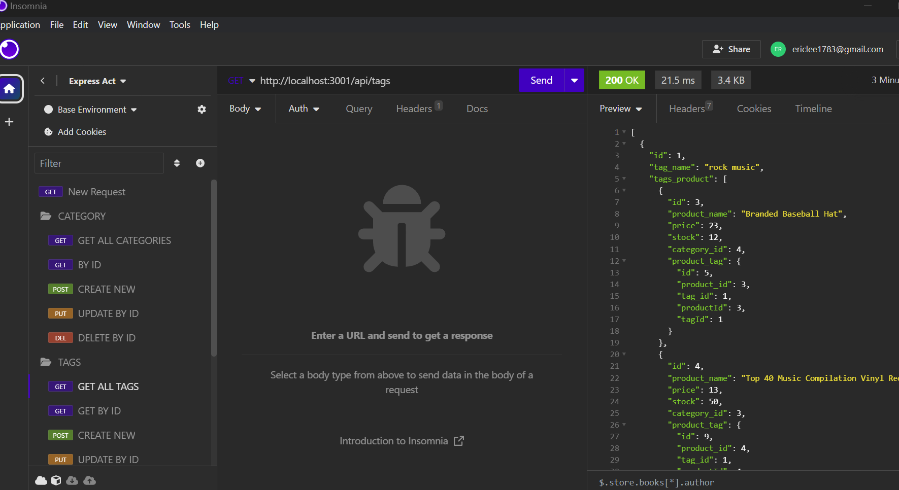

# E-commerce Back End Starter Code

## Description
This application allows us to test different routes using Insomnia by inputting the correct URL. Each URL is then taken to different sets of data where each data is linked by their unique IDs connecting the whole data together.

## Installation
Please run the command npm i before testing out this application.

## Usage

Each routes are organized into folders with the ability to Create, Read, Update, and Delete from any data.